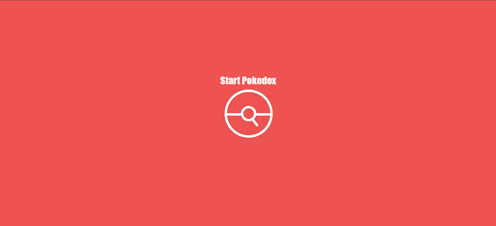
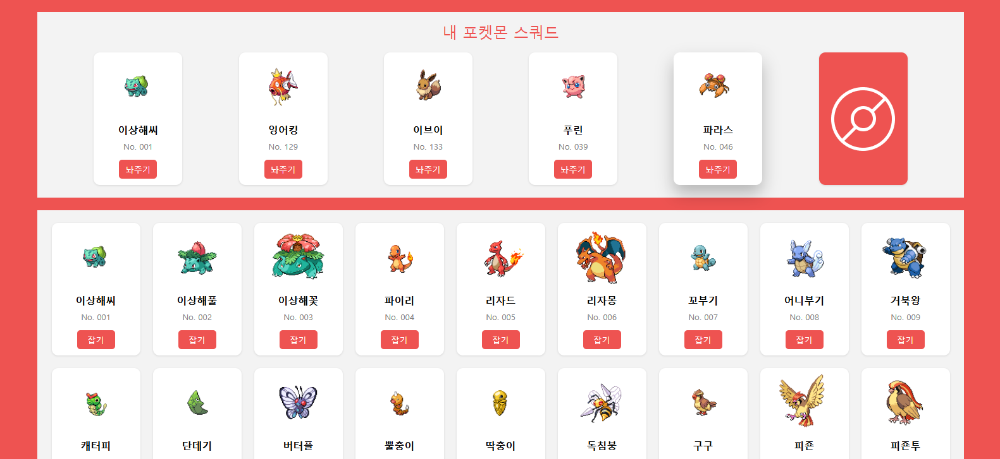
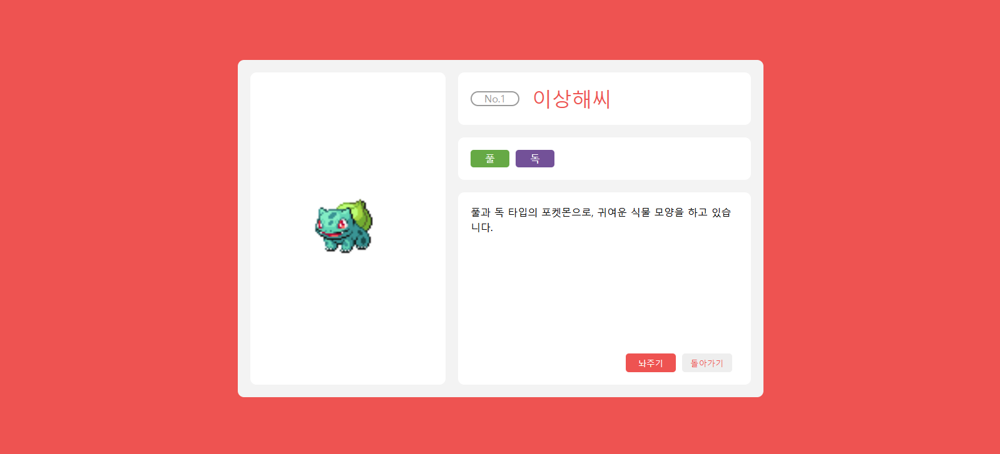

# 🤪 Pokedex: 나만의 포켓몬 도감
- **배포 주소** : https://my-pokedex-rho.vercel.app/
 

 
 
 

## 📜프로젝트 소개
>**개발 기간 :** 2025/02/03 ~ 2025/02/10

**나만의 포켓몬 도감 만들기**  

1세대 포켓몬들의 목록을 보면서 좋아하는 포켓몬을 내 스쿼드에 저장할 수 있는 웹 애플리케이션입니다. 카드를 누르면 상세 페이지에서 더 많은 정보를 볼 수 있고, 내 스쿼드 포함 여부에 따라 추가 혹은 방출이 가능합니다. 
 
 
 

## 🪄프로젝트 특징
- 브랜치별로 상태 관리 방법을 다르게 하여 만들었습니다.  
  - `prop-drilling` : useState와 props를 사용하여 구현 
  - `context` : Context API 사용
  - `redux-without-toolkits` : RTK 없이 Redux 기본 문법만을 사용하여 구현
  - `redux-toolkits` : RTK를 사용하여 구현

- **CSS Grid**를 활용하여 반응형 페이지를 구현했습니다.  
- **Styled Components**를 사용하여 CSS in JS 스타일링을 했습니다.
- `react-router-dom`을 이용하여 페이지 간 이동을 설정했습니다.
- **브라우저 저장소**를 사용하여 내 포켓몬 스쿼드를 브라우저가 기억하도록 했습니다. 
- `react-toastify`를 사용하여 toast UI를 구현했습니다. 
 
 
 

## 🔫트러블 슈팅
- ### [payload는 payload다](https://velog.io/@arendt9797/%ED%8A%B8%EB%9F%AC%EB%B8%94%EC%8A%88%ED%8C%85-payload%EB%8A%94-payload%EB%8B%A4)

- ### [Immer는 전지전능이 아니다](https://velog.io/@arendt9797/%ED%8A%B8%EB%9F%AC%EB%B8%94%EC%8A%88%ED%8C%85-Immer%EB%8A%94-%EC%A0%84%EC%A7%80%EC%A0%84%EB%8A%A5%EC%9D%B4-%EC%95%84%EB%8B%88%EB%8B%A4)
 
 
 

## 🖥️기술 스택
### 환경
  

### 개발
  